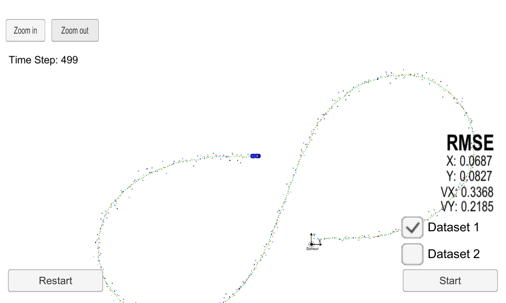

# Unscented Kalman filter

The goal of this project is to fuse Lidar and Radar sensor data using a
Unscented Kalman
filter algorithm . The Unscented Kalman filter is to be implemented in C++. The kalman filter
executable talks to the term2_simulator via websockets. The simulator provides the radar and
lidar measurements. The Unscented Kalman filter should make a good enough
prediction of th position and velocity of the car by fusing the Lidar and Radar
data

## Repository details
-'src/ukf.cpp': Unscented kalman filter algorithm implementation
-'src/tools.cpp': Some helper functions

## Results with dataset 1

RMSE: [px,py,vx,vy] = [0.0687,0.0827,0.3368,0.2185]
*Thresold* [.09, 0.1, 0.4, 0.3]

